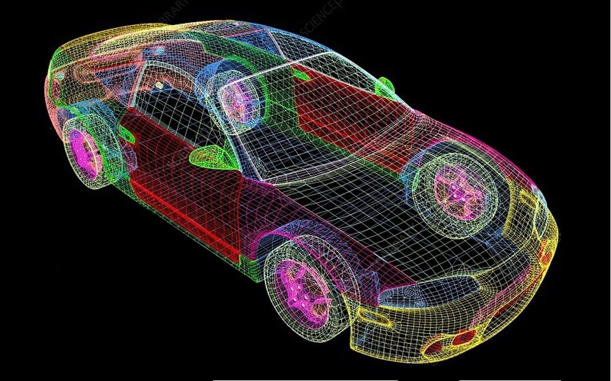

## Future CAD Trends to Watch in 2024

The world of CAD (computer-aided design) is continuously evolving. With advances in AI, cloud computing, and industry demands, new trends are set to transform how engineers and designers work. Let’s explore the top CAD trends to watch in 2024.

### 1. **AI-Assisted Design**
Artificial Intelligence is already making waves in CAD, but 2024 will see a broader adoption of AI-assisted design. AI algorithms can help automate repetitive tasks, optimize designs, and even suggest improvements based on machine learning models.

AI in CAD systems enables engineers to focus on higher-level tasks while the software handles the heavy lifting of analysis and optimization.

### 2. **Cloud-Based CAD Platforms**
Cloud-based CAD platforms like Fusion 360 and Onshape have already demonstrated the benefits of collaboration and accessibility. In 2024, we can expect more companies to move their design workflows to the cloud, reducing hardware costs and increasing scalability.

### 3. **Generative Design**
Generative design is pushing the boundaries of innovation by using algorithms to create complex structures that would be impossible for human designers to conceive manually. This trend will continue to expand as companies leverage generative tools to explore new possibilities in product design.

### 4. **AR and VR Integration**
Augmented Reality (AR) and Virtual Reality (VR) are no longer just buzzwords. CAD software is now integrating these technologies to create immersive design experiences. Engineers can now step inside their designs, inspect components, and make adjustments in real-time within a virtual environment.

### 5. **Sustainability-Driven Design**
With global focus shifting towards sustainability, CAD software will be used more for optimizing materials, minimizing waste, and creating energy-efficient products. Companies will focus on eco-friendly CAD tools that provide metrics on environmental impact throughout the product's lifecycle.

---

For more CAD insights and trends, check out the [GrabCAD](https://grabcad.com/) community or dive into [Engineers Rule](https://www.engineersrule.com/).

<blockquote>
  Stay ahead of the curve by adopting these trends in your CAD workflows!
</blockquote>
